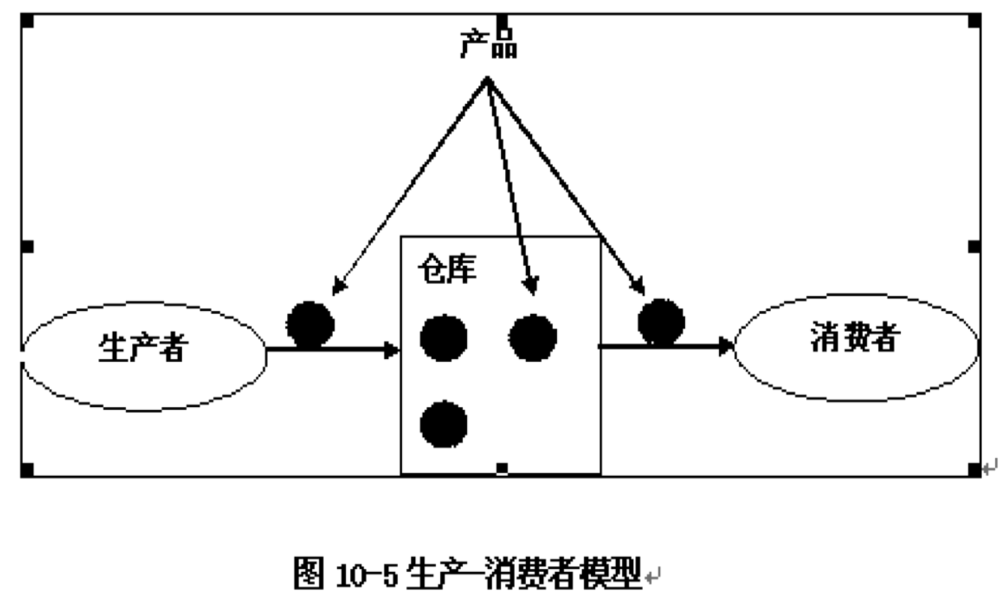

[TOC]

#多线程编程技术

##进程与线程的基本概念

###进程

随着计算机的飞速发展，个人计算机上的操作系统也纷纷采用多任务和分时设计，将早期只有大型计算机才具有的系统特性带到了个人计算机系统中。一般可以在同一时间内执行多个程序的操作系统都有进程的概念。

- 一个进程就是一个执行中的程序，而每一个进程都有自己独立的一块内存空间、一组系统资源。
- 进程是操作系统中正在执行的不同应用程序的一个实例，操作系统把不同的进程分离开来
- 每一个进程的内部数据和状态都是完全独立的。

###线程

- 线程是操作系统分配处理器时间的基本单元，每个线程都维护异常处理程序、调度优先级和一组系统用于在调度该线程前保存线程上下文的结构

- 每个应用程序域都是用单个线程启动的（应用程序的入口点main()方法），应用程序域中的代码可以创建附加应用程序域和附加线程

####一个线程由三个主要部分组成

- 一个虚拟处理机
- CPU执行的代码
- 代码操作的数据

代码可以或不可以由多个线程共享，这时数据是独立的。两个线程如果执行同一个类的实例代码，则它们可以共享相同的代码。
类似地，数据可以或不可以由多个线程共享，这时代码是独立的。两个线程如果共享对一个公共对象的存取，则它们可以共享相同的数据。 

####优点：

- 多线程编程简单，效率高（能直接共享数据和资源，多进程不能）
- 适合于开发服务程序（如Web服务，聊天服务等）
- 适合于开发有多种交互接口的程序（如聊天程序的客户端，网络下载工具）
- 减轻编写交互频繁、涉及面多的程序的困难（如监听网络端口）
- 程序的吞吐量会得到改善（同时监听多种设备，如网络端口、串口、并口以及其他外设）
- 有多个处理器的系统，可以并发运行不同的线程（否则，任何时刻只有一个线程在运行）

####线程的缺点

- 多线程处理可解决用户响应性能和多任务的问题，但同时引入了资源共享和同步问题等问题

<!---线程处理使程序能够执行并发处理，因而特别适合需要同时执行多个操作的场合

Java程序通过流控制来执行程序流，程序中单个顺序的流控制称为线程，多线程则指的是在单个程序中可以同时运行多个不同的线程，执行不同的任务。多线程意味着一个程序的多行语句可以看上去几乎在同一时间内同时运行。--->

###线程与进程的区别

线程与进程相似，是一段完成某个特定功能的代码，是程序中单个顺序的流控制。

但与进程不同的是，同类的多个线程共享一块内存空间和一组系统资源，而线程本身的数据通常只有微处理器的寄存器数据，以及一个供程序执行时使用的堆栈。
所以系统在产生一个线程，或者在各个线程之间切换时，负担要比进程小的多，正因如此，线程被称为轻负荷进程（light-weight process）。一个进程中可以包含多个线程。一个线程是一个程序内部的顺序控制流。主要区别如下：

1. 进程：每个进程都有独立的代码和数据空间（进程上下文） ，进程切换的开销大。 
2. 线程：轻量的进程，同一类线程共享代码和数据空间，每个线程有独立的运行栈和程序计数器（PC），线程切换的开销小。 
3. 多进程：在操作系统中，能同时运行多个任务程序。 
4. 多线程：在同一应用程序中，有多个顺序流同时执行。

##在Java语言中，创建、启动、暂停、中断和终止线程

应用程序运行时，运行环境调用应用程序的入口点（main()方法）时，将创建应用程序主线程

<!---【例10.1】Java应用程序主线程示例。当运行此应用程序时，先提示：“主线程：开始……”，然后主线程进入睡眠，5秒钟后显示：“主线程：结束！”
--->

主线程以外的线程一般称之为工作线程

###创建线程有两种方式

- 继承java.lang.Thread类
- 实现java.lang.Runnable接口

可以根据具体的应用环境进行选择。参见JDK API

####继承Thread类

- 该方法比较简单，主要是通过继承java.lang.Thread类，并覆盖Thread类的run()方法来完成线成的创建。
- Thread类是一个具体的类，即不是抽象类，该类封装了线程的行为。
- 要创建一个线程，程序员必须创建一个从Thread类导出的新类。
- Thread类中有两个最重要的函数run()和start()。 

<!---
可以创建1个Thread（或其派生类）对象实例，即创建1个线程。当调用Thread（或其派生类）对象实例的start()方法时，将自动调用对象的run()方法（线程任务代码的实现），即运行线程。
如果对象的run()方法结束（或运行过程抛出异常），则线程结束，且线程对象实例等待垃圾回收处理
Thread类中提供了许多管理线程的方法，包括创建、启动和暂停等
--->

#####通过继承Thread类创建新线程的大致步骤如下:

- 创建一个将在主线程外执行的函数，即类的方法，用于执行新线程要执行的逻辑操作
- 在主线程（main()方法）中创建一个步骤1中所创建的派生类的实例。例如：

~~~java
MyThread thread1 = new MyThread()
~~~

- 调用步骤2中创建的Thread的实例的start()方法，以启动新线程。例如：

~~~java
thread1.start()
~~~

<!---【例10.2】通过继承Thread类创建和启动新线程示例--->

#####通过继承Thread类创建和启动新线程示例

~~~java
public class MyThread extends Thread
{ // count变量用于统计打印的次数并共享变量
	private static int count = 0;
	public MyThread(String name){super(name);}
	public static void main(String[] args){// main方法开始
		MyThread p = new MyThread("t1"); // 创建一个线程实例
		p.start(); // 执行线程
		// 主线程main方法执行一个循环
		for (int i = 0; i < 5; i++) {
			count++;
			// 主线程中打印count+“main”变量的值，并换行
			System.out.println(count + ": main");
		}
	}

public void run()
	{// 线程类必须有的run（）方法
		for (int i = 0; i < 5; i++) {
			count++;
			System.out.println(count + ":" + this.getName());
		}
	}
}
~~~

#####Thread类有很多重载的构造方法：

- Thread() 
- Thread(Runnable target) 
- Thread(Runnable target, String name) 
- Thread(String name) 
- Thread(ThreadGroup  group, Runnable  target) 
- Thread(ThreadGroup group , Runnable target, String  name) 
- Thread(ThreadGroup group , String name) 

参数target是线程执行的目标对象，即线程执行的代码；group是线程所在的组；name是线程的名字。

####实现Runnable接口

该方法通过生成实现java.lang.Runnable接口的类。
该接口只定义了一个方法run()，所以必须在新类中实现它。
但是Runnable接口并没有任何对线程的支持，我们还必须创建Thread类的实例，这一点通过Thread类的构造函数

~~~java
public Thread(Runnable target);
~~~

来实现。

#####通过实现Runnable接口创建新线程的大致步骤

- 创建一个实现Runnable接口的派生类，并重写继承的方法run()，用于执行新线程要执行的逻辑操作
- 在主线程（main()方法）中创建一个步骤1中所创建的派生类的实例
- 在主线程（main()方法）中，使用步骤2中所创建的对象实例作为参数，创建一个Thread对象实例
- 调用步骤2中创建的Thread实例的Start()方法，以启动新线程

<!---【例10.3】通过实现Runnable接口创建和启动新线程示例--->

#####通过实现Runnable接口创建和启动新线程示例

~~~java
public class MyThread2 implements Runnable{
	int count=1,number;
	public MyThread2(int i){
		number=i;
		System.out.println("创建线程"+number);
		}
	public void run(){
		while(true){
		    System.out.println(“线程”+number+“计数 "+count);
			if(++count==3)
				return;
		}
	}

public static void main(String args[]){
	  for(int i=0;i<3;i++)
          {
	    Thread p =new Thread(new MyThread2(i+1));
            p.start();
          }
	}
}
~~~

new MyThread2(i+1) 对象是实现了Runnable接口的实体，作为Thread构造方法的形参。

#####通过匿名类

可以直接通过匿名类的方式创建新线程

- 在主线程（main()方法）中，使用一个实现Runnable接口的匿名派生类对象为参数，创建一个Thread对象实例
- 调用步骤1中创建的Thread实例的Start()方法，以启动新线程

<!---【例10.4】通过匿名类创建和启动新线程示例--->

##线程状态和生命周期

- 线程是动态的，具有一定的生命周期，分别经历从创建、执行、阻塞直到消亡的过程。
- 在每个线程类中都定义了用于完成实际功能的run方法，这个run方法称为线程体（Thread Body）。
- 按照线程体在计算机系统内存中的状态不同，可以将线程分为创建(new)、就绪(runnable)、运行、阻塞（blocked）和死亡（dead）5个状态， 

<!---
线程的创建
创建一个线程的对象实例，即创建一个线程，此时该线程处于初始状态（Thread.State.New）

线程的属性设置和获取
通过Thread类的实例方法来设置或获取线程的各种属性
线程的启动、停止、挂起和唤醒
通过对象实例的start()/stop()/suspend()/resume()方法，可以启动/停止/挂起/继续线程
休眠（暂停）线程sleep()
静态方法Thread.sleep(long millis)和Thread.sleep(long millis, int nanos)强制当前正在执行的线程休眠（暂停执行）

线程让步yield()
Thread.yield()是让当前线程暂停，转入可运行状态，JVM的线程调度器重新调度执行可运行状态的线程
线程加入join()
让包含代码的线程（tc，即当前线程）“加入”到另外一个线程（t）的尾部。在线程t执行完毕之前，线程tc不能执行
【例10.5】加入线程示例
中断线程interrupt()
【例10.6】中断线程示例
终止线程：run()方法完成后，线程正常终止
【例10.7】终止线程示例
--->

###就绪状态和阻塞状态转换

在状态转换的各个过程中，最关键也是最复杂的就是就绪状态和阻塞状态转换的过程。
Java 提供了大量方法来支持阻塞。

####sleep() 方法：
sleep()允许指定以毫秒为单位的一段时间作为参数，它使得线程在指定的时间内进入阻塞状态，不能得到CPU 时间，指定的时间一过，线程重新进入可执行状态。
典型地，sleep()被用在等待某个资源就绪的情形：测试发现条件不满足后，让线程阻塞一段时间后重新测试，直到条件满足为止。

####suspend()和resume()方法：
两个方法配套使用，suspend()使得线程进入阻塞状态，并且不会自动恢复，必须其对应的resume()被调用，才能使得线程重新进入可执行状态。
典型地，suspend()和resume()被用在等待另一个线程产生的结果的情形：测试发现结果还没有产生后，让线程阻塞，另一个线程产生了结果后，调用resume()使其恢复。

在线程运行过程中调用sleep方法后，该线程在不释放占用资源的情况下停止运行指定的睡眠时间。
时间到达后，线程重新由JVM线程调度器进行调度和管理。
而调用suspend方法后，线程将释放占用的所有资源，由JVM调度转入临时存储空间，直至应用程序调用resume方法恢复线程运行。

####wait()和notify()方法：
两个方法配套使用，wait()使得线程进入阻塞状态，它有两种形式，一种允许指定以毫秒为单位的一段时间作为参数，另一种没有参数，前者当对应的notify()被调用或者超出指定时间时线程重新进入就绪，后者则必须对应的notify()被调用。
<!---关于这两个方法在线程死锁中将着重介绍。 --->

#####wait()方法的语义是：
当一个线程执行了该方法，则该线程进入阻塞状态，同时让出同步对象的互斥锁，并自动进入互斥对象的等待队列。

#####notify()方法的语义是: 
当一个线程执行了该方法，则拥有该方法的互斥对象的等待队列中的第一个线程被唤醒，同时自动获得该互斥对象的互斥锁，并进入就绪状态等待调度。

####void jion()
等待指定的线程运行结束当线程不活动时，jion()才会返回
####void jion(long timeout)
等待指定的线程运行结束，但不超过指定的超时值
####yield()：
可以用来使具有相同优先级的线程获得执行的机会。如果具有相同优先级的其它线程是可运行的，yield()将把调用线程放到可运行池中并使另一个线程运行。如果没有相同优先级的可运行进程，yield()什么都不做。 

###抢先式调度

线程调度器按线程的优先级高低选择高优先级线程（进入运行中状态）执行，同时线程调度是抢先式调度，即如果在当前线程执行过程中，一个更高优先级的线程进入可运行状态，则这个线程立即被调度执行。 
抢先式调度又分为：时间片方式和独占方式。

####时间片方式

当前活动线程执行完当前时间片后，如果有其他处于就绪状态的相同优先级的线程，系统会将执行权交给其他就绪态的同优先级线程；当前活动线程转入等待执行队列，等待下一个时间片的调度。 

####独占方式

当前活动线程一旦获得执行权，将一直执行下去，直到执行完毕或由于某种原因主动放弃CPU，或者是有一高优先级的线程处于就绪状态。 
####线程会放弃CPU

下面几种情况下，当前线程会放弃CPU: 

1. 线程调用了yield() 或sleep() 方法主动放弃； 
2. 由于当前线程进行I/O 访问，外存读写，等待用户输入等操作，导致线程阻塞；或者是为等候一个条件变量，以及线程调用wait（）方法； 
3. 抢先式系统下，由高优先级的线程参与调度；时间片方式下，当前时间片用完，由同优先级的线程参与调度。 

##线程优先级和线程调度

Java将每个线程都分配一个优先级，优先级用正整数设置，通常为1-10。
默认情况下，创建的线程最初被分配的优先级是5，数字越大表明线程的级别越高。

Thread类中声明了3个定义线程优先级范围的静态最终常量：

- Thread.MIN_PRIORITY（1、最低）
- Thread.NORM_PRIORITY（5、普通）
- Thread.MAX_PRIORITY（10、最高）

通过线程对象的实例方法setPriority(int newPriority)，即可以设定线程对象的优先级

<!---【例10.9】线程优先级和线程调度示例--->

###Daemon线程

在Java中比较特殊的线程是被称为守护（Daemon）线程的低级别线程。
这个线程具有最低的优先级，用于为系统中的其它对象和线程提供服务。

将一个用户线程设置为守护线程的方式是在线程对象创建之前调用线程对象的setDaemon方法。
典型的守护线程例子是JVM中的系统资源自动回收线程，它始终在低级别的状态中运行，用于实时监控和管理系统中的可回收资源。

<!---
- 用户线程（非Daemon线程）是通常意义的线程
- 如果在主线程中创建新线程时，通过线程的setDaemon()方法（注：必须在线程启动之前调用），可以设置该线程为Daemon线程

【例10.8】用户线程和Daemon线程示例
--->

~~~java
public class TestThreadPriority extends Thread {
   String strMessage;

   public TestThreadPriority(String strPara) {
     strMessage = strPara;
   }

	public static void main(String[] args) {
		TestThreadPriority testThreadPriority1 = new TestThreadPriority("Thread1");
    	testThreadPriority1.setPriority(Thread.MIN_PRIORITY); 

		testThreadPriority1.start();
	    TestThreadPriority testThreadPriority2 = new TestThreadPriority("Thread2");
   		 testThreadPriority2.setPriority(Thread.NORM_PRIORITY);
    	testThreadPriority2.start();
    	TestThreadPriority testThreadPriority3 = new TestThreadPriority("Thread3");
    	testThreadPriority3.setPriority(Thread.MAX_PRIORITY);
    	testThreadPriority3.start();
   }

	public void run() {
   		 for(int i=0; i<3;i++)
      	System.out.println(this.getName()+"is running!");
	}
}

~~~

##线程互斥

###问题的提出

类Acount代表一个银行账户。其中变量balance是该账户的余额。

~~~java
public class Acount{
  double balance;
  public Acount(double money){
    balance = money;
    System.out.println("Totle Money: "+balance);
  }
}
~~~

下面我们定义一个线程，该线程的主要任务是从Acount中取出一定数目的钱。 

~~~java
public class AcountThread extends Thread {
  Acount acount;
  int delay;
  public AcountThread(Acount acount,int delay) {
    this.acount =acount;
    this.delay = delay;
  }

public void run(){
    if(acount.balance >= 100){
         try{
           sleep(delay);
           acount.balance = acount.balance - 100;
           System.out.println("withdraw  100 successful!");
         }catch(InterruptedException e)  {       
         }
        }
        else
          System.out.println("withdraw failed!");
  }

public static void main(String[] args) {
    Acount acount = new Acount(100);
    AcountThread acountThread1 = new AcountThread(acount,1000);
    AcountThread acountThread2 = new AcountThread(acount,0);
    acountThread1.start();
    acountThread2.start();
  }
}

~~~

运行结果如下：

>Totle Money: 100.0
>withdraw  100 successful!
>withdraw  100 successful!

- 该结果非常奇怪，因为尽管账面上只有100元，但是两个取钱线程都取得了100元钱，也就是总共得到了200元钱。出错的原因在哪里呢？
- 由于线程1在判断满足取钱的条件后，被线程2打断，还没有来得及修改余额。因此线程2也满足取钱的条件，并完成了取钱动作。从而使共享数据balance的完整性被破坏。 

<!---上面的问题，并不是新问题，其实在并发程序设计中已经被研究并得到了解决。我们首先回忆两个概念。--->

###临界资源

在并发程序设计中，对多线程共享的资源或数据成为临界资源，而把每个线（进）程中访问临界资源的那一段代码段成为临界代码段。
通过为临界代码段设置信号灯，就可以保证资源的完整性，从而安全地访问共享资源 

为了实现这种机制，Java语言提供以下两方面的支持：

1. 为每个对象设置了一个“互斥锁”标记。该标记保证在每一个时刻，只能有一个线程拥有该互斥锁，其它线程如果需要获得该互斥锁，必须等待当前拥有该锁的线程将其释放。该对象成为互斥对象。因此，java中的每一个对象都是互斥对象.

2. 为了配合使用对象的互斥锁，Java语言提供了保留字synchronized.其基本用法如下：

~~~java
synchronized(互斥对象){
    临界代码段
}
~~~

###修改后的程序

~~~java
class Semaphore{}
public class AcountThread2 extends Thread {
  Acount acount;
  int delay;
  Semaphore semaphore;
  public AcountThread2(Acount acount,int delay,Semaphore semaphore) {
    this.acount =acount;
    this.delay = delay;
    this.semaphore = semaphore;
  }

public void run(){
    synchronized (semaphore) {
      if (acount.balance >= 100) {
        try {
          sleep(delay);
          acount.balance = acount.balance - 100;
          System.out.println("withdraw  100 successful!");
        }
        catch (InterruptedException e) {
        }
      }
      else
        System.out.println("withdraw failed!");
    }
  }
  
public static void main(String[] args) {
    Acount acount = new Acount(100);
    Semaphore semaphore = new Semaphore();
    AcountThread2 acountThread1 = new AcountThread2(acount,1000,semaphore);
    AcountThread2 acountThread2 = new AcountThread2(acount,0,semaphore);
    acountThread1.start();
    acountThread2.start();
  }
}

~~~

###线程同步
当多个线程同时调用单个对象的方法时，一个线程可能会中断另一个线程正在执行的任务，使该对象处于一种无效状态，因此这些调用必须进行同步处理

在实际应用中，多个线程之间不仅需要互斥机制来保证对共享数据的完整性，而且有时需要多个线程之间互相协作，按照某种既定的步骤来共同完成任务。

####生产-消费者模型
一个典型的应用模型。其约束条件为：

1. 生产者负责产品，并将其保存到仓库中；
2. 消费者从仓库中取得产品。
3. 由于库房容量有限，因此只有当库房还有空间时，生产者才可以将产品加入库房；否则只能等待。只有库房中存在满足数量的产品时，消费者才能取走产品，否则只能等待。 

<!---【例10.11】线程同步示例--->

实际应用中的许多例子都可以归结为该模型。
如在操作系统中的打印机调度问题，库房的管理问题等。

为了研究该问题，我们仍然以前面的存款与取款问题作为例子，假设存在一个账户对象(仓库)及两个线程：存款线程(生产者)和取款线程(消费者)，并对其进行如下的限制；

1. 只有当账户上的余额balance=0时，存款线程才可以存进100元；否则只能等待；
2. 只有当账户上的余额balance=100时，取款线程才可以取走100元；否则只能等待。 

利用wait()方法和notify()方法，上面的程序修改如下

~~~java
public class Acount4 {
  double balance;
  public Acount4(){
     balance = 0;
     System.out.println("Totle Money: "+balance);
   }
   public synchronized void withdraw(double money){
       if(balance == 0)
         try{
              wait();      
         }catch(InterruptedException e){
        }
         balance = balance - money;
         System.out.println("withdraw 100 success");
         notify();
       }

public synchronized void deposite(double money){
     if (balance != 0)
       try {
         wait();
       }
       catch (InterruptedException e) {
       }
     balance = balance + money;
     System.out.println("deposite 100 success");
     notify();
   }
}

public class AcountThread3 extends Thread {
  Acount2 acount;
  public AcountThread3(Acount2 acount) {
    this.acount = acount;
  }
  public void run(){
    acount.withdraw(100);
  }
   public static void main(String[] args) {
     Acount2 acount = new Acount2(100);
     AcountThread3 acountThread31 = new AcountThread3(acount);
     AcountThread3 acountThread32 = new AcountThread3(acount);
     acountThread31.start();
     acountThread32.start();
  }
}

~~~

<!---
####使用synchronized同步

使用synchronized关键字修饰方法，可以将一个方法声明为同步方法。同步方法可以确保当一个线程执行该方法时，该方法保持锁定状态，另一个线程不会进入该方法。如果其他线程试图执行该方法，则它将一直等待（即被阻止），直到锁定的方法被释放
--->

<!---【例10.12】synchronized同步方法示例--->

<!---
使用synchronized关键字将语句块标记为临界区，方法是获取给定对象的互斥锁，执行语句，然后释放该锁
synchronized关键字可以确保当一个线程位于代码的临界区时，另一个线程不会进入该临界区。如果其他线程试图进入锁定的代码，则它将一直等待（即被阻止），直到该对象被释放
--->
<!---【例10.13】使用synchronized语句同步代码块示例--->

###线程死锁

####哲学家用餐问题

我们可以想象，如果每个哲学家都彬彬有礼，并且高谈阔论，轮流吃饭，则这种融洽的气氛可以长久地保持下去。但是可能出现这样一种情景：当每个人都拿起自己左手边的筷子，并同时去拿自己右手边的筷子时，会发生什么情况：五个人每人拿着一支筷子，盯着自己右手边的那位哲学手里的一支筷子，处于僵持状态。这就是发生了“线程死锁”。

需要指出的事，线程死锁并不是必然会发生，在某些情况下，可能会非常偶然。

线程死锁只是系统的一种状态，该状态出现的机会可能会非常小，因此简单的测试往往无法发现。
遗憾的是Java语言也没有有效的方法可以避免或检测死锁，因此我们只能在程序设计中尽力去减少这种情况的出现。

一般来说，要出现死锁必须同时具备四个条件。
因此，如果能够尽可能地破坏这四个条件中的任意一个，就可以避免死锁的出现。

1. 互斥条件。即至少存在一个资源，不能被多个线程同时共享。如在哲学家问题中，一支筷子一次只能被一个哲学家使用。
2. 至少存在一个线程，它拥有一个资源，并等待获得另一个线程当前所拥有的资源。如在哲学家聚餐问题中，当发生死锁时，至少有一个哲学家拿着一支筷子，并等待取得另一个哲学家拿着的筷子。
3. 线程拥有的资源不能被强行剥夺，只能有线程资源释放。如在哲学家问题中，如果允许一个哲学家之间可以抢夺筷子，则就不会发生死锁问题。

###线程死锁是并发程序设计中可能遇到的问题

它是指程序运行中，多个线程竞争共享资源时可能出现的一种系统状态：线程1拥有资源1，并等待资源2，而线程2拥有资源2，并等待资源3,…,以此类推，线程n拥有资源n-1,并等待资源1。在这种状态下，各个线程互不相让，永远进入一种等待状态。

###线程间通信

为了解决死锁的问题，Java引入了线程间通信的通信机制：wait()、notify()和notifyAll()

线程之间的通讯问题是指线程之间相互传递信息，这些信息包括数据、控制指令等。我们前面举例中数据共享也是线程的一种通信方式。

此外，java语言还提供了线程之间通过管道来进行通信的方式。其结构表示。管道通信具有如下特点：

- 管道是单向的。
一个线程充当发送者，另一个线程充当接收者。如果需要建立双向通信，可以通过建立多个管道解决。

- 管道通信是面向连接的。
因此在程序设计中，一方线程必须建立起对应的端点，由另一方线程来建立连接。

- 管道中的信息是严格按照发送的顺序进行传送的。
因此接收受方收到的数据和发送方在顺序上完全一致。

~~~java
import java.io.*;
class SenderThread extends Thread{
  PipedWriter pipedWriter;
  public SenderThread( ){
  pipedWriter = new PipedWriter( );
  }
  public PipedWriter getPipedWriter( ){
    return pipedWriter;
  }
  public void run( ){
    for (int  i =0; i<5;i++){
     try{
      pipedWriter.write(i); 
     }catch(IOException e){   
     }
     System.out.println("Send: "+i);
    }
  }
}

~~~
<!---
wait()、notify()和notifyAll()

【例10.14】~【例10.15】线程间通信示例--->

<!---
java.util.Timer和java.util.TimerTask

Timer是一种定时器工具，用来在一个后台线程计划执行指定任务。Timer可以计划执行一个任务一次或反复多次。TimerTask是一个抽象类，它的子类代表一个可以被Timer计划的任务
【例10.16】~【例10.17】任务调度线程示例

##线程池
所有线程都隶属于一个线程组。默认情况下，线程属于主线程组（系统线程组、默认线程组）。程序中也可以创建新的线程组，并作为参数传递给线程的构造方法，以指定该线程是某一个线程组的线程
线程组也必须从属于其他线程组
--->

##练习

1．创建线程有哪两种方法？并进行比较，说明各自特点。
2．简述线程的生命周期。
3．设计一个程序，每隔一秒显示一次系统时间。
4．设计一个程序，该程序包含两个线程，一个线程做冒泡排序，一个线程做插入排序。
5．设计一个生产者-消费者程序。对一个对象（堆栈）进行操作，生产者是一个压入线程，它不断向堆栈中压入数据；消费者是一个弹出线程，它不断从堆栈中弹出数据。设计的程序应避免共享资源带来的问题，使两个线程能够正确地对堆栈对象进行操作。

<!---
##接口

抽象类和接口 

初始化块

初始化块用来和构造方法一起初始化对象。初始化块是封装在一对大括号内的语句块，初始化块在类的定义体内，但不能包含在方法体内或构造方法体内。初始化块分为对象（实例）初始化块和静态（类）初始化块。 
静态数据成员、初始化块和构造方法的执行顺序如下：
(1) 当第一次使用类时，首先装载类，初始化静态数据成员，然后执行类的静态初始化块。
(2) 当使用new运算符创建类的对象时，按下述三个步骤执行：
① 调用父类的构造方法（在调用父类的构造方法时，也按照这三个步骤执行）。
② 初始化实例数据域，执行对象初始化块。
③ 执行构造方法。
--->

---

本文档 Github ：
https://github.com/bushehui/Java_tutorial

